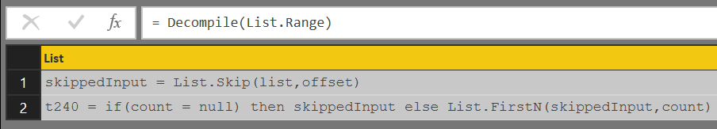

# Power Query Decompiler
This repository contains a proof of concept on decompiling Power Query (M) functions.


## Structure

`AST.pq` - a deep call to `Value.ResourceExpression` in order to demo how the Abstract Syntax Tree (AST) looks for  `List.Range` 
```
=Value.ResourceExpression(List.Range)
    [Expression]
        [Arguments]{0}
            [Function]
                [Expression]
                    [Expression]
```

`AST2json.pq` - serializing the output from `Value.ResourceExpression` to `JSON` 

`Decompile.pq` - function definition that translates an AST into an expression

`Expression.pq` - same code as `Decompile(x)` function exposed as an expression(query)

## Functions that are "decompilable"

The query that would return the list of functions that should deompile is:
```
= List.Select(Record.FieldNames(#shared),each Value.ResourceExpression(Record.Field(#shared,_))[Kind]="Function")
```
Which brings up this output:

`Date.DayOfWeekName` , `Date.IsInCurrentDay` , `Date.IsInCurrentMonth` , `Date.IsInCurrentQuarter` , `Date.IsInCurrentWeek` , `Date.IsInCurrentYear` , `Date.IsInNextDay` , `Date.IsInNextMonth` , `Date.IsInNextNDays` , `Date.IsInNextNMonths` , `Date.IsInNextNQuarters` , `Date.IsInNextNWeeks` , `Date.IsInNextNYears` , `Date.IsInNextQuarter` , `Date.IsInNextWeek` , `Date.IsInNextYear` , `Date.IsInPreviousDay` , `Date.IsInPreviousMonth` , `Date.IsInPreviousNDays` , `Date.IsInPreviousNMonths` , `Date.IsInPreviousNQuarters` , `Date.IsInPreviousNWeeks` , `Date.IsInPreviousNYears` , `Date.IsInPreviousQuarter` , `Date.IsInPreviousWeek` , `Date.IsInPreviousYear` , `Date.IsInYearToDate` , `Date.MonthName` , `DateTime.IsInCurrentHour` , `DateTime.IsInCurrentMinute` , `DateTime.IsInCurrentSecond` , `DateTime.IsInNextHour` , `DateTime.IsInNextMinute` , `DateTime.IsInNextNHours` , `DateTime.IsInNextNMinutes` , `DateTime.IsInNextNSeconds` , `DateTime.IsInNextSecond` , `DateTime.IsInPreviousHour` , `DateTime.IsInPreviousMinute` , `DateTime.IsInPreviousNHours` , `DateTime.IsInPreviousNMinutes` , `DateTime.IsInPreviousNSeconds` , `DateTime.IsInPreviousSecond` , `List.FindText` , `List.MatchesAll` , `List.MatchesAny` , `List.NonNullCount` , `List.Range` , `List.RemoveItems` , `List.RemoveLastN` , `List.ReplaceValue` , `Replacer.ReplaceValue` , `SqlExpression.SchemaFrom` , `Table.AddColumn` , `Table.AlternateRows` , `Table.Buffer` , `Table.ColumnCount` , `Table.ColumnsOfType` , `Table.CombineColumns` , `Table.Contains` , `Table.ContainsAll` , `Table.ContainsAny` , `Table.DemoteHeaders` , `Table.DuplicateColumn` , `Table.ExpandListColumn` , `Table.ExpandTableColumn` , `Table.FillUp` , `Table.FindText` , `Table.FirstValue` , `Table.HasColumns` , `Table.InsertRows` , `Table.IsDistinct` , `Table.IsEmpty` , `Table.Last` , `Table.LastN` , `Table.MatchesAllRows` , `Table.MatchesAnyRows` , `Table.Max` , `Table.MaxN` , `Table.Min` , `Table.MinN` , `Table.Partition` , `Table.PositionOf` , `Table.PositionOfAny` , `Table.PrefixColumns` , `Table.Profile` , `Table.Range` , `Table.RemoveLastN` , `Table.RemoveMatchingRows` , `Table.RemoveRows` , `Table.Repeat` , `Table.ReplaceMatchingRows` , `Table.ReplaceRows` , `Table.ReplaceValue` , `Table.ReverseRows` , `Table.Schema` , `Table.SplitColumn` , `Table.ToColumns` , `Table.ToRows` , `Table.TransformRows` , `Table.Transpose` , `Table.View` , `Text.AfterDelimiter` , `Text.BeforeDelimiter` , `Text.BetweenDelimiters` , `Text.Format` , `Type.TableSchema`
