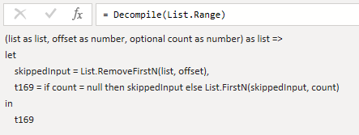

# Power Query Decompiler

A proof of concept for decompiling Power Query (M) functions back into readable M source code, by walking the undocumented AST returned by `Value.ResourceExpression`.



## Usage

Paste `Decompile.pq` into Power BI Desktop / Excel Power Query as a query named `Decompile`, then invoke it on any decompilable function:

```
= Decompile(List.Range)
```

which produces:

```
(list as list, offset as number, optional count as number) as list =>
let
    skippedInput = List.RemoveFirstN(list, offset),
    t115 = if count = null then skippedInput else List.FirstN(skippedInput, count)
in
    t115
```

## What it handles

- Stripping the compiler's runtime type-checking harness (`Value.As` wrappers and immediate lambda self-applications), while harvesting the type information it carries to re-emit `as` ascriptions on function signatures
- Re-sugaring desugared `let` expressions (the compiler turns `let` into record field access), including recursive bindings (`@f`)
- `if`/`then`/`else`, binary and unary operators, `a .. b` ranges, `x meta y`
- `error`, `try ... otherwise`, `try ... catch`
- Lists, records, field/element access, `each` lambdas, optional parameters
- Resolving references to other library functions through the closure's constant pool

Known limitations: non-primitive type expressions are only recovered down to their primitive kind, genuinely anonymous helper functions render as `function`, enum constants render as their raw numbers (e.g. `1200` for `TextEncoding.Unicode`), and there is no round-trip verification yet.

## Structure

| File | Role |
|---|---|
| `Decompile.pq` | The decompiler as a function `(fn as function) => text`. Single source of truth for all logic. |
| `Expression.pq` | Same logic exposed as a query, with the target function bound inline (`fn = List.Range`). |
| `AST2json.pq` | Diagnostic: serializes the raw AST from `Value.ResourceExpression` to JSON — the primary debugging tool: `Text.FromBinary(AST2json(fn))`. |
| `AST.pq` | Historical demo of a raw path into the AST for `List.Range` (superseded by `Decompile.pq`). |
| `Test.pq` | Regression harness: runs `Decompile` over every decompilable function in `#shared` and reports a Name / Ok / Code / Error table. Requires a query named `Decompile` in the same workbook. |

`AST.pq` demos the original deep call into the AST:

```
=Value.ResourceExpression(List.Range)
    [Expression]
        [Arguments]{0}
            [Function]
                [Expression]
                    [Expression]
```

## Functions that are "decompilable"

Decompilation works for functions whose resource expression has `[Kind] = "Function"` — roughly 100 functions from the standard library, plus user-defined functions whose resource expression is exposed. 
The query that returns the list is:

```
= List.Select(Record.FieldNames(#shared),each Value.ResourceExpression(Record.Field(#shared,_))[Kind]="Function")
```

Which brings up this output:

`Binary.View` , `Cdm.MapToEntity` , `Date.DayOfWeekName` , `Date.IsInCurrentDay` , `Date.IsInCurrentMonth` , `Date.IsInCurrentQuarter` , `Date.IsInCurrentWeek` , `Date.IsInCurrentYear` , `Date.IsInNextDay` , `Date.IsInNextMonth` , `Date.IsInNextNDays` , `Date.IsInNextNMonths` , `Date.IsInNextNQuarters` , `Date.IsInNextNWeeks` , `Date.IsInNextNYears` , `Date.IsInNextQuarter` , `Date.IsInNextWeek` , `Date.IsInNextYear` , `Date.IsInPreviousDay` , `Date.IsInPreviousMonth` , `Date.IsInPreviousNDays` , `Date.IsInPreviousNMonths` , `Date.IsInPreviousNQuarters` , `Date.IsInPreviousNWeeks` , `Date.IsInPreviousNYears` , `Date.IsInPreviousQuarter` , `Date.IsInPreviousWeek` , `Date.IsInPreviousYear` , `Date.IsInYearToDate` , `Date.MonthName` , `DateTime.IsInCurrentHour` , `DateTime.IsInCurrentMinute` , `DateTime.IsInCurrentSecond` , `DateTime.IsInNextHour` , `DateTime.IsInNextMinute` , `DateTime.IsInNextNHours` , `DateTime.IsInNextNMinutes` , `DateTime.IsInNextNSeconds` , `DateTime.IsInNextSecond` , `DateTime.IsInPreviousHour` , `DateTime.IsInPreviousMinute` , `DateTime.IsInPreviousNHours` , `DateTime.IsInPreviousNMinutes` , `DateTime.IsInPreviousNSeconds` , `DateTime.IsInPreviousSecond` , `Emigo.GetExtractFunction` , `EmigoDataSourceConnector.GetExtractFunction` , `HexagonSmartApi.ApplySelectList` , `HexagonSmartApi.ExecuteParametricFilterOnFilterRecord` , `HexagonSmartApi.ExecuteParametricFilterOnFilterUrl` , `HexagonSmartApi.GenerateParametricFilterByFilterSourceType` , `HexagonSmartApi.Typecast` , `List.FindText` , `List.MatchesAll` , `List.MatchesAny` , `List.NonNullCount` , `List.Range` , `List.RemoveItems` , `List.RemoveLastN` , `List.ReplaceValue` , `MongoDBAtlasODBC.Query` , `Replacer.ReplaceValue` , `SqlExpression.SchemaFrom` , `Table.AddColumn` , `Table.AddRankColumn` , `Table.AlternateRows` , `Table.ColumnCount` , `Table.ColumnsOfType` , `Table.CombineColumns` , `Table.CombineColumnsToRecord` , `Table.Contains` , `Table.ContainsAll` , `Table.ContainsAny` , `Table.DemoteHeaders` , `Table.DuplicateColumn` , `Table.ExpandListColumn` , `Table.ExpandTableColumn` , `Table.FillUp` , `Table.FindText` , `Table.FirstValue` , `Table.HasColumns` , `Table.InsertRows` , `Table.IsDistinct` , `Table.IsEmpty` , `Table.Last` , `Table.LastN` , `Table.MatchesAllRows` , `Table.MatchesAnyRows` , `Table.Max` , `Table.MaxN` , `Table.Min` , `Table.MinN` , `Table.Partition` , `Table.PositionOf` , `Table.PositionOfAny` , `Table.PrefixColumns` , `Table.Profile` , `Table.Range` , `Table.RemoveLastN` , `Table.RemoveMatchingRows` , `Table.RemoveRows` , `Table.Repeat` , `Table.ReplaceMatchingRows` , `Table.ReplaceRows` , `Table.ReplaceValue` , `Table.ReverseRows` , `Table.Schema` , `Table.SplitColumn` , `Table.ToColumns` , `Table.ToRows` , `Table.TransformRows` , `Table.Transpose` , `Table.View` , `Text.AfterDelimiter` , `Text.BeforeDelimiter` , `Text.BetweenDelimiters` , `Type.TableSchema`

## Caveats

`Value.ResourceExpression` is undocumented and the AST shapes it returns may change between engine versions without notice — the decompiler is written defensively, but expect drift. When it encounters an AST node kind it does not know, it fails loudly with a `Decompile.UnknownKind` error carrying the raw node.
